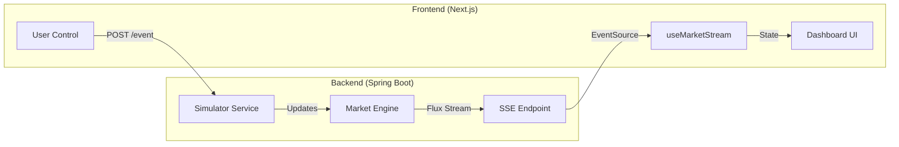

# ⚡ GridSync

> **A Futuristic Peer-to-Peer Microgrid Trading Simulator**  
> *Visualizing the future of decentralized energy markets.*

---

## 🌍 The Vision

**GridSync** reimagines the power grid as a **decentralized, autonomous market**. Instead of a central utility feeding passive consumers, GridSync visualizes a network where:
*   **Solar House A** sells excess energy directly to **EV Garage B**.
*   Prices fluctuate in **real-time** based on local supply and demand.
*   **Autonomous Agents** trade on your behalf to optimize costs.

This project is a high-fidelity simulation of a **DePIN (Decentralized Physical Infrastructure Network)** economy.

---

## 🚀 Tech Stack

| Component | Technology | Key Features |
| :--- | :--- | :--- |
| **Backend** |   | **WebFlux (Reactive Streams)**, **SSE (Server-Sent Events)**, Simulation Engine |
| **Frontend** |   | **Glassmorphism UI**, Real-time Charting, EventSource API |
| **Communication** | SSE (Server-Sent Events) | Unidirectional real-time data streaming (Backend -> Frontend) |

---

## 🎮 Features

### 1. 📊 Real-Time Market Visualization
Watch the heartbeat of the grid. See energy packets flowing instantly between nodes and track the **Spot Price ($/kWh)** as it reacts to network stress.

### 2. 🤖 Autonomous Economic Agents
The simulation runs "Smart Nodes" that act independently:
*   **☀️ Producers:** Sell valid solar surplus.
*   **⚡ Consumers:** Buy energy when needed (e.g., charging EV).
*   **⇆ Prosumers:** Tesla Powerwall-style nodes that buy low and sell high.

### 3. 🌩️ Interactive Chaos Engineering
**You are the Grid Operator.** Use the Dashboard Control Panel to trigger disasters:
*   **Heatwave:** Spikes demand (AC units turning on). Watch prices soar!
*   **Storm:** Clouds cover solar panels. Generation drops, and the grid must recover.

---

## 🏗️ Architecture



---

## ⚡ Getting Started

### Prerequisites
*   **Java 21** (JDK 21)
*   **Node.js** (v18+)

### 1. Start the Backend (The Grid)
```bash
cd backend
./mvnw spring-boot:run
```
*The simulation will start running at `http://localhost:8080`.*

### 2. Start the Frontend (The Dashboard)
```bash
cd frontend
npm install
npm run dev
```
*Open `http://localhost:3000` to enter the portal.*

---

## 🔮 Future Roadmap
- [ ] **Blockchain Integration:** Log trades on Solana/Ethereum for immutable proof.
- [ ] **Physical IoT:** Connect to actual ESP32 microcontrollers simulating smart meters.
- [ ] **AI Forecasting:** Use LSTM models to predict load spikes.

---

### Author
**Krishna Bandewar**  
*Building the future of software.*
